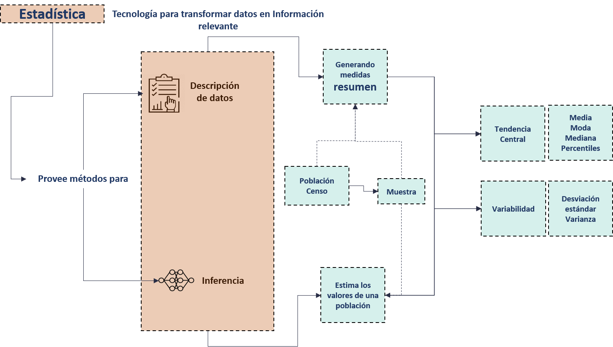
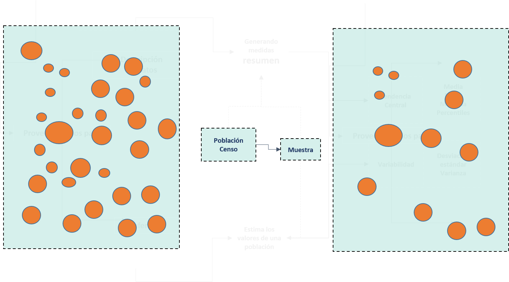
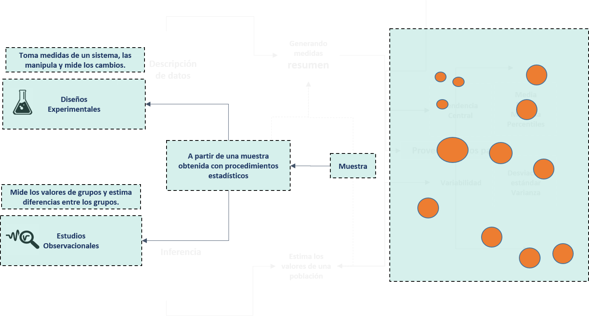
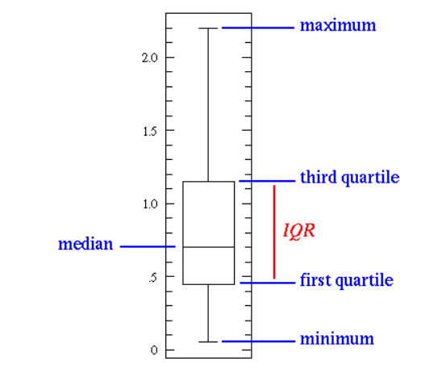

```{r setup, include=FALSE}
knitr::opts_chunk$set(echo = TRUE)

#install.packages("kableExtra") Mejor renderización de tablas

library(kableExtra)

```


# Estadística Conceptos básicos



El anterior diagrama muestra las dos grandes áreas de la estadística clásica

- **La estadística descriptiva**: Se refiere a todas las herramientas de recolección, procesamiento, visualización, análisis y presentación de un conjunto de datos sin generalizar o ir mas allá que ese conjunto de datos.Por ejemplo, en un departamento de recursos humanos que se analiza la totalidad de la rotación de personal.Los resultados concluídos solamente son válidos para esa empresa en un espacio y tiempo dados y especificados.

- **La estadística inferencial**: Su contraparte, la estadística inferencial, puede generalizar a través de una muestra de los datos ( obtenida con procedimientos rigurosos) a un "universo" o "población" de mayor tamaño a la cuál representa.Siguiendo el mismo ejemplo, una empresa de recursos humanos, puede tomar una muestra de empresas para analizar la situación de la rotación en empresas de zona Franca.Esta población también debe ser definida en tiempo y espacio para poder conocer el alcance del análisis.





A su vez, cuando se realiza cualesquiera de estos dos tipos de estadística, un fin último es poder agregar los datos recolectados en medidas resumen de dos tipos:

- **Medidas de Tendencia Central**: Estas medidas tienen el objetivo de conocer los valores centrales en los cuáles los datos tienden a concentrarse, usualmente representados por el valor promedio o media, la mediana, la moda y los percentiles.

- **Medidas de Variabilidad**: La variabilidad o varianza es una de las razones de ser de la estadística.Ya que cuando se realizan mediciones, por la característica de todos los fenómenos de la naturaleza, existen variaciones en las observaciones.Siguiendo el ejemplo de la rotación, no existe la posibilidad de encontrar dos empresas iguales en cuanto al tiempo que todos los empleados estuvieron en dichas empresas.Para conocer que tanta variabilidad ocurre en un fenómeno, se mide la varianza y la desviación estándar.

Vamos a conocer más a detalle estas medidas más adelante.

# Paquetes estadísticos básicos

En R, existen miles de paquetes que pueden ser instalados desde el repositorio [CRAN](https://cran.r-project.org/).Estos paquetes amplian la funcionalidad básica del lenguaje, agregando funciones específicas de miles de campos científicos, tecnológicos, académicos o de negocios.

[En este link] https://support.rstudio.com/hc/en-us/articles/201057987-Quick-list-of-useful-R-packages se presenta un listado curado de paquetes básicos para el análisis estadístico que serán (o podrían ser) utilizados a lo largo del curso.

Vamos a instalar unos cuantos:

```{r Paquetes, eval=F}

# Instala 3 paquetes para manipulación de datos, visualización de datos y análisis exploratorio, respectivamente.
install.packages('dplyr');install.packages('ggplot'); install.packages('dlookr')

```

Posterior a instalarlos, debemos cargarlos en el ambiente con la función `library(<nombrePaquete>)` :

```{r Paquetes2, eval=T,message=F,warning=F}

library(dplyr)

```

No obstante, a continuación una forma mas eficiente y elegante de realizar este proceso, en el que se chequea si el paquete esta instalado o no; si el paquete no esta instalado se instala y carga y si el paquete ya esta instalado solo se carga:


```{r paquetes3}


##Primero se crea un objeto con los paquetes que se desean instalar/cargar

paquetes<- c("ggplot2","lubridate")

##Aplica un ciclo iterativo para comprobar el estado de cada paquete e instalar si corresponde

 for (i in paquetes){
   if (i %in% installed.packages()[,"Package"] == FALSE){
     install.packages(i,repos="http://cran.rstudio.com/");
   }
 }

#Carga los paquetes sin generar mensajes o warnings

sapply(paquetes,library,character.only=TRUE,quietly=T)


```


# Carga de archivos

Para proceder con la práctica de los contenidos meramente estadísticos ya previamente repasados, vamos a ver un procedimiento para cargar un archivo .csv

Si un archivo de texto esta separado por "," o ";", usualmente se lee como un archivo de extensión .csv.Para esto se utiliza la función `read.csv`.

En este primer caso lo vamos a hacer desde un archivo local.Para esto, primero debemos "setear" el directorio de trabajo o donde se encuentra el archivo, para poder leerlo.

Puede obtener los datos actualizados al día de hoy, corriendo el siguiente [script de R](https://gist.github.com/DFJL/ce5391baa01259ecd81ef59f168f8a14)

```{r csv}

# Set wd

# Se debe poner un string con el path en donde se encuentra el archivo

wd <- "/cloud/project/Clase1"


# Esta instrucción indica que el string wd con el path sea el nuevo Working Directory

setwd(wd)

# Crea un nuevo objeto en R, leyendo el archivo .csv ubicado en el WD.
df <- read.csv("covidCantones.csv",sep = ",")

#Visualizar los datos(20 primeros registros)

head(df,20)


```

Para mas detalle en como cargar archivos en R, se puede referir a este [link].https://rpubs.com/Felipe1986/Clase4

# Obtención de muestras aleatorias

Entrando en calor, vamos a proceder a utilizar algunos de los paquetes ya mencionados, para practicar los conceptos estadísticos estudiados.Para empezar, utilizaremos la sintaxis del paquete ´dplyr´ para obtener una muestra.Recordemos que este paquete:

- es muy potente para la manipulación de datos, contando con una gran cantidad de funciones de diversa índole 
- y una sintaxis fácil de leer 
- y que cuenta con la característica de que se asemeja a SQL.

```{r muestra}

library(dplyr)

dfMuestra <- df %>%  # >%> se puede leer como " y entonces lo siguiente es..."
  sample_n(size = 10)

dfMuestra


```


Si queremos visualizar las tablas de una manera más estetica, podemos utilizar el paquete ´kabbleExtra´ para tablas:

```{r tablasKabble}


kable(head(dfMuestra,10)) %>%
  kable_styling(bootstrap_options = c("striped", "hover"))%>%
   scroll_box(width = "900px", height = "500px")


```

# Medidas de tendencia central

Como ya se mencionó anteriormente, existen varias medidas de tendencia central.La siguiente imagen ilustra algunas de ellas:



- **Media**: Es el valor promedio de los datos.Se obtiene sumando todos los datos y dividiendolo entre la cantidad de registros.A continuación vamos a obtener la media del conjunto de datos de COVID de cantones que cargamos previamente

```{r media}

# Cálculo manual

#Media de casos recuperados

MediaA <-sum(df$Recovered,na.rm = TRUE) / nrow(df)

#Mediante función

MediaB<- mean(df$Recovered,na.rm = TRUE) # na.rm = TRUE esta instrucci[on es para que no tome en cuenta los valores nulos del dataset.

MediaA;MediaB


```

- **Mediana**: La mediana es el valor que se encuentra exactamente en el 50% de los datos.Es decir, 50% de las observaciones son menores a ese valor y 50% son mayores a ese valor.

-**Percentiles**: Para generalizar la mediana, el percentil, es el valor en donde se encuentra el n% de los datos.Donde n es un número que va del 1 al 99.Por ejemplo, el percentil 10, indica que un 10% de las observaciones son menores a ese valor y un 90% son mayores a ese valor.

```{r tiles}

#Mediana de casos

MedianaCasos <-median(x = df$Recovered,na.rm = TRUE) 

MedianaCasos

# Percentiles

Percentil90<-  quantile(x = df$Recovered,probs =  .9,na.rm = TRUE) 

Percentil90


```


De esta manera, el 50% de los cantones tienen menos de  `r MedianaCasos`  y el otro 50% tienen mas de `r MedianaCasos`.

Por otro parte, el 90% de los cantones tienen menos de `r Percentil90` y solo un 10% tiene más de `r Percentil90` 


Para resumir los percentiles, se utilizan algunos terminos convenientes:

| Percentil      | Nùmero | Descripción     |
| :----:        |    :----:   |          :--- |
| Decil    | 1-10       | Divide los datos en 10 grupos.   |
| Cuartil  | Q1-Q2-Q3      | Cuartill 1 (Percentil 25), Cuartil 2 (Percentil 50), Cuartil 3 (Percentil 75)     |
| Quintil  | Q1-Q2-Q3-Q4    | Quintil 1 (Percentil 20),Quintil 2 (Percentil 40), Quintil 3 (Percentil 60), Quintil 4 (Percentil 80) |

Este es un ejemplo gráfico de como se dividen los cuartiles:


Ahora, vamos a calcular los quintiles:

```{r tiles2}

#Quintiles

quintiles90<-  quantile(x = df$Deaths,probs = c(.2,.4,.6,.8),na.rm = TRUE) 

quintiles90


```


