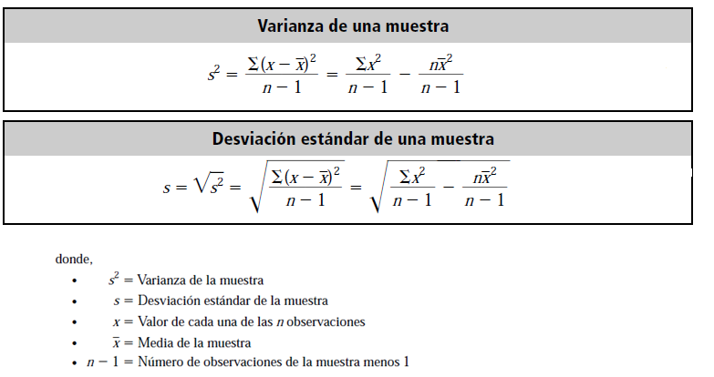

```{r setup, include=FALSE}
knitr::opts_chunk$set(echo = TRUE)

#install.packages("kableExtra") Mejor renderización de tablas

library(kableExtra)

```


# Medidas de Variabilidad


Dentro de las medidas de variabilidad, vamos a estudiar tres:

- Rango
- Rango intercuartil
- Desviación estándar (varianza)

## Rango

El rango , es sencillamente la diferencia entre el valor máximo en el conjunto de datos analizado y el valor mínimo:


Vamos a ejemplificar el cálculo en R:

```{r}

# set wd

wd<- "/cloud/project/Clase2"

setwd(wd)


# Lectura de archivo de datos de covid cantones

covidCantones <- read.csv(file = "covidCantones.csv",sep= ";")

#Cálculo del rango de casos

rango1<- max(covidCantones$Cases,na.rm = TRUE)- min(covidCantones$Cases,na.rm = TRUE)

rango1

rango2<- range(covidCantones$Cases,na.rm = TRUE)

rango2

rango2[2]-rango2[1]

```

La función `range` tiene como resultado el valor maximo y el valor minimo de los datos.Por este motivo se debe restar los índices para obtener el rango de la variable.

En este caso, el rango es de `r rango1`, que se interpreta como la diferencia de casos entre el cantón que más casos cuenta y el que menos casos cuenta.

## Rango intercuartil


El rango intercuartil, conceptualmente se asemeja al rango, pero con la diferencia que sustituye los valores máximos y mínimos por el cuartil 3(percentil 75) y el cuartil 1 (percentil 25), lo que previene la afectación por valores extremos.Utilizaremos la función `IQR` para calcular esta estadística:

```{r IQR}

IQR(covidCantones$Cases)


```

Lo que significa que existe una diferencia de `r IQR(covidCantones$Cases)` casos de COVID-19 entre el percentil 75 y el percentil 25.


## Desviación estándar


La desviación es la medida de variabilidad por excelencia y utilizada en la mayoría de aplicaciones, debido a que toma en cuenta todos los datos para su cálculo.

Para efectos del cálculo, en realidad, primero se calcula la varianza.Sin embargo, la varianza da como resultados valores elevados al cuadrado.Debido a lo anterior, para efectos de interpretación, nace la desviación estándar como la raiz cuadrada de la varianza.

La desviación estándar es un promedio de las dispersiones de las observaciones individuales con respecto a la media.



```{r desvest}

sd(covidCantones$Cases)


```

En nuestro ejemplo, la dispersión media de casos de COVID19 por cantón es de `r round(sd(covidCantones$Cases),2)`

## Coeficiente de variación

En muchas ocasiones, cuando queremos comparar la variabilidad de dos variables diferentes o dos grupos diferentes, la desviaicón estándar no es la medida más adecuada debido a las diferencias en las distribuciones de las variables o las dimensiones.Por ejemplo, si queremos estudiar la variabilidad de pesos y alturas de estudiantes y comparar o comparar el peso de animales de gran diferencia en escala ( escarabajos vrs hipopotamos).En estos casos, es prudente utilizar el coeficiente de variación, que es sencillamente la desviación estándar dividido entre su media.Usualmente se expresa en porcentaje y a mayor porcentaje indica mayor variabilidad relativa.

```{r CV}

sd(covidCantones$Cases)/mean(covidCantones$Cases)*100
sd(covidCantones$Recoveries)/mean(covidCantones$Recoveries)*100


```

En este caso existe una mayor dispersión relativa en los casos recuperados, comparado con el total de casos.

# Introduccion al paquete `dplyr`

Como ya lo comentamos en la clase anterior, la mayoría de procesamientos estadísticos básicos los realizaremos con el paquete `dplyr`.

`dplyr` conocido en el ambiente de R como la gramática de la manipulación de datos, contiene diversas funciones o verbos, que realizan alguna operación en particular sobre el conjunto de datos en cuestión y que cuenta con la característica de ser flexible y crear operaciones complejas debido a la diversidad de verbos, preservando la legibilidad del código mediante el operador de encadenamiento `%>%`.La siguiente imagen ilustra la gramática de `dplyr` y su comparación con enfoques clásicos en cuanto a legibilidad:


A continuación, podemos visualizar gráficamente algunos de los verbos mas utilizados de dplyr en función de la operación que realizan a los datos:


# Tipos de variables


La forma de abordar un análisis en estadística, debe inicialmente considerar el tipo de variable y su naturaleza.Como analicemos cada variable y su correcta interpretación, depende de si es cuantitativa o cualitativa.

Las variables **cualitativas** tienen como característica que los valores observados son categorías o grupos, como por ejemplo el género( femenino, masculino u otro) o la presencia o ausencia del COVID19 en una persona, mientras que las variables **cuantitativas** los resultados de las mediciones son valores numéricos, como la cantidad de casos de COVID19 en los cantones del país.

Vamos a analizar en más detalle las diferencias:

## Variables cualitativas

Existen dos formas de separar las variables cualitativas, básicamente si podemos naturalmente ordenarlas por sus valores o no:


Como podemos ver en la anterior imagen, una variable cualitativa se analiza inicialmente contando la cantidad de registros o casos por cada categoría.Adicionalmente se pueden obtener los porcentajes por categoría para una mejor interpretación.Lo veremos a continuación con un ejemplo en R y el paquete ` dplyr `:

```{r,warning=FALSE,message=FALSE}

library(dplyr)

cantonesAgrupado <- covidCantones %>% # Primero creamos un dataframe copia del df cargado.
  group_by(Province) %>%  # Agrupamos por la variable de interes para sumarizar
  summarise(CasesT= sum(Cases,na.rm = TRUE)) %>% # Se obtiene la suma por provincia.
  mutate(PCases= CasesT/sum(CasesT)*100) %>%
  arrange(desc(PCases)) # se ordenan los casos de menor a mayor según su porcentaje.

cantonesAgrupado

```

En el caso anterior, estamos agrupando por una variable nominal, ya que no podemos ordenar las provincias naturalmente.

Cuando una variable es ordinal, además de la frecuencia absoluta y la frecuencia relativa obtenidas anteriormente, se puede de la misma manera calcular la frecuencia acumulada absoluta y la frecuencia acumulada relativa.

El siguiente ejemplo contiene datos ficticios de una muestra de personas que quedaron desempleadas producto del COVID19, según el nivel académico:


## Variable Cuantitativas


A su vez las variables cuantitativas se separan conceptualmente en dos categorías:

- **intervalo** cuando el cero no es absoluto, es decir el cero representa aún un valor.
- **razón** cuando el cero representa realmente la ausencia de la variable observada, en el ejemplo 0 cm de estatura significa que no tiene estatura el objeto medido.

En la siguiente clase estaremos analizando las variables cuntitativas desde un punto de vista descriptivo, en el siguiente orden:

- Distribución de frecuencia
- histograma
- boxplot
- Métricas para caracterizar la forma de la distribución estadística.


# Poniendo todo lo visto en práctica (variabilidad, dplyr, tipos de variables)

Vamos a empezar a realizar análisis estadístico, pero dentro de los grupos que se encuentran en los datos, para poder realizar comparaciones, utilizando  el paquete ` dplyr `.
En este caso, queremos comparar las medidas de variabilidad por provincia.


```{r}

library(dplyr)

cantonesAgrupado2 <- covidCantones %>% # Primero creamos un dataframe copia del df cargado.
  group_by(Province) %>%  # Agrupamos por la variable de interes para sumarizar
  summarise(CasesT= sum(Cases,na.rm = TRUE),
            RecoveriesT = sum(Recoveries,na.rm = TRUE),
            sdCases= sd(Cases,na.rm = TRUE),
            sdRecoveries = sd(Recoveries,na.rm = TRUE),
            DeathsT = sum(Deaths,na.rm = TRUE)
            ) %>%
  mutate(PCases= CasesT/sum(CasesT)*100) %>%
  arrange(desc(PCases))
  
  
cantonesAgrupado2

```


