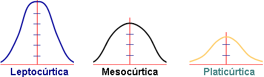

```{r setup, include=FALSE}

library(learnr)

knitr::opts_chunk$set(echo = TRUE,warning = FALSE, message = FALSE)
tutorial_options(exercise.timelimit = 120)


covidCantones <- read.csv("https://raw.githubusercontent.com/DFJL/Datasets/master/covidCantones.csv",sep= ";")

mobilityCR <- read.csv("https://raw.githubusercontent.com/DFJL/Datasets/master/mobilityCR.csv",sep= ";") 

claims <- read.csv("https://raw.githubusercontent.com/DFJL/Datasets/master/unemploymentClaims.csv", sep= ";")


```


## 6: Boxplots

Continuando con las visualizaciones para realizar análisis exploratorio de datos, el boxplot provee muchisima información de las variables cuantitativas.


El siguiente es un ejemplo de un boxplot:


Como se puede observar, el boxplot permite visualizar en un mismo gráfico información sobre la distribución de los datos, valores centrales como la mediana y la media( no incluída en el ejemplo) , los cuartiles, el rango intercuartil, valores mínimos y máximos y posibles valores extremos.

Con el R base, podemos crear boxplots con mucha flexibilidad.Para este ejemplo utilizaremos el archivo de datos movilidad en Costa Rica en el año 2020 producto del COVID-19:

```{r 11, exercise=TRUE}

library(dlookr)
library(dplyr)

mobilityCR <- read.csv("https://raw.githubusercontent.com/DFJL/Datasets/master/mobilityCR.csv",sep= ";") 

# Tomamos un vistazo a los datos
glimpse(mobilityCR)

# Delimitando el dataframe, procedemos a dibujar el boxplot para la variable  `workplaces_percent_change_from_baseline`:

boxplotCR<- boxplot(mobilityCR$workplaces,
        main = "Costa Rica:Cambio porcentual diario de estancias en lugares de trabajo, con respecto a línea base 2019",
        xlab = "Cambio porcentual(línea base 2019)",
        ylab = "workplaces",
        col = "orange",
        border = "brown",
        horizontal = TRUE
)

boxplotCR


```


De igual manera, se pueden comparar varios grupos o variables en un mismo boxplot, a efectos de poder visualizar fácilmente varios elementos y poder comparar.Solamente se agrega la nueva variable en la función:


```{r 12, exercise=TRUE}


boxplotCR2<- boxplot(mobilityCR$workplaces,
                     mobilityCR$residential,
                     main = "Costa Rica:Cambio porcentual diario, con respecto a línea base 2019",
                     at = c(1,2),
                     names = c("workplaces","residential"),
                     col = c("orange","lightblue"),
                     border = "brown",
                     horizontal = TRUE
                     )

print(boxplotCR2)


```


Que pasa si queremos comparar varios boxplots, pero en lugar de utilizar columnas de una dataframe, queremos comparar grupos de una sola columna? Por ejemplo, queremos comparar el cambio en residencias por mes.Para esto podemos utilizar la sintaxis de las fórmulas de R (`~`):


```{r 13, exercise=TRUE}


boxplotCR3<- boxplot(residential~month,
                     data=mobilityCR,
                     main="Cambio porcentual de estancia promedio residencial por mes",
                     xlab="Mes",
                     ylab="Cambio Porcentual",
                     col="orange",
                     border="brown"
                     )

print(boxplotCR3)


```

Notese que los dos anteriores boxplots pertenecen al espectro del **Análisis Exploratorio Bivariado**, ya que se considera el cruce de dos variables para obtener patrones y relaciones entre estas.

Todo el análisis anterior a esto, es considerado **Análisis Exploratorio Univariado**

**Su Turno**

- Utilizando el dataset `mobilityCR` dibuje un boxplot por mes para la variable `workplaces`

```{r T3, exercise=TRUE}


```

Puede visualizar mas ejemplos en el siguiente vinculo

[boxplots](https://www.datamentor.io/r-programming/box-plot/)


## 7: Outliers

Como hemos podido identificar en algunos de los resultados anteriores como los boxplots, es importante identificar outliers de un conjunto de datos para tomar decisiones sobre que hacer con estos.Los outliers o valores atípicos, como su nombre lo indica, son valores que se salen de los rangos donde están concentrados la mayor cantidad de datos, tanto en el extremo inferior como en el extremo superior.


Para ejemplificar el uso de outliers vamos a volver al paquete `dlookr`, ya que cuenta con herramientas sencillas para su identificación y tratamiento:


la función `diagnose_outlier()` crea un resumen con diversas métricas con respecto a los outliers:

```{r 14, exercise=TRUE}


library(dlookr)
library(scales)
library(dplyr)

claims <- read.csv("https://raw.githubusercontent.com/DFJL/Datasets/master/unemploymentClaims.csv", sep= ";")

outliers <-diagnose_outlier(claims) %>%
  mutate(outliers_ratio= percent(outliers_ratio/100,accuracy = 2))

outliers

```


Las variables del output  `tbl_df` retornado por  `diagnose_outlier()` son las siguientes:

- `outliers_cnt` : Cantidad de outliers
- `outliers_ratio` : Porcentaje de outliers
- `outliers_mean` : Promedio de los outliers en la variable
- `with_mean` : Promedio de la variable con outliers
- `without_mean` : Promedio de la variable sin outliers


**Visualización de outliers usando `plot_outlier()`**

Esta función permite visualizar los outliers de las variables numéricas de un dataframe.El uso es igual al de la función `diagnose()`

El gráfico derivado del uso de la función tiene los siguientes resultados:

- Gráfico del boxplot con outliers.
- Gráfico del boxplot sin outliers.
- Histograma con outliers
- Histograma sin outliers.

```{r 15, exercise=TRUE}


library(dlookr)
library(scales)
library(dplyr)

claims <- read.csv("https://raw.githubusercontent.com/DFJL/Datasets/master/unemploymentClaims.csv", sep= ";")


#Paso 1 Se crea un dataframe del dataframe claims solo con las variables cuyo % es mayor a .5

outliersVars <- diagnose_outlier(claims) %>% 
                 filter(outliers_ratio >= 0.01) %>% 
                 select(variables) %>% 
                 unlist()

#Paso 2 Se gráfica sobre el dataframe previamente calculado

plot_outlier(claims,outliersVars)


```


## 8: Entendiendo la forma de los datos

Los histogramas son muy importantes para entender la forma o distribución de los datos analizados.Estos son una aproximacion a la verdadera curva de la distribución de los datos.Es importante analizar estas distribuciones ya que usualmente deben ser similares a modelos teoricos matematicos a efectos de poder ajustar a modelos estadísticos más avanzados e inferenciales como el análisis de regresión entre otros.

El siguiente video introducirá dos conceptos hasta el momento no estudiados importantes de conocer a efectos de realizar el diagnóstico de lo comentado en el párafo anterior:

- **distribución normal**.
- **asimetría**.


{width="90%"}

**Valores de la asimetría (g1)**

- **(g1 = 0)**: Se acepta que la distribución es Simétrica, es decir, existe aproximadamente la misma cantidad de valores a los dos lados de la media. Este valor es difícil de conseguir por lo que se tiende a tomar los valores que son cercanos ya sean positivos o negativos (± 0.5).

- **(g1 > 0)**: La curva es asimétricamente positiva por lo que los valores se tienden a reunir más en la parte izquierda que en la derecha de la media.

- **(g1 < 0)**: La curva es asimétricamente negativa por lo que los valores se tienden a reunir más en la parte derecha de la media

Adicionalmente la **curtosis**, no mencionada en el video,es una medida de forma que mide cuán achatada está una curva o distribución.

Esta medida determina el grado de concentración que presentan los valores en la región central de la distribución. Por medio del Coeficiente de Curtosis, podemos identificar si existe una gran concentración de valores (Leptocúrtica), una concentración normal (Mesocúrtica) ó una baja concentración (Platicúrtica).

- Una curtosis de la muestra que se desvía significativamente de 0 puede indicar que los datos no están distribuidos normalmente



**Valores de la curtosis (g2)**

**(g2 = 0)** la distribución es Mesocúrtica: Al igual que en la asimetría es bastante difícil  encontrar un coeficiente de Curtosis de cero (0), por lo que se suelen aceptar los valores cercanos (± 0.5 aprox.).

**(g2 > 0)** la distribución es Leptocúrtica

**(g2 < 0)** la distribución es Platicúrtica

## 8.2: Curtosis y asimetría

Con `dlookr`, podemos utilizar a función `describe(df)`, para poder obtener la curtosis y la asimetría(skewness)

```{r 16, exercise=TRUE}


library(dlookr)
library(dplyr)

describe(claims)


```


Usando a su vez `dplyr`, se pueden ordenar y seleccionar las variables con mayor asimetría:

```{r 17, exercise=TRUE}

library(dlookr)
library(dplyr)


claims %>%
  describe() %>%
  select(variable, skewness, mean, p25, p50, p75) %>% 
  filter(!is.na(skewness)) %>% 
  arrange(desc(abs(skewness)))


```

