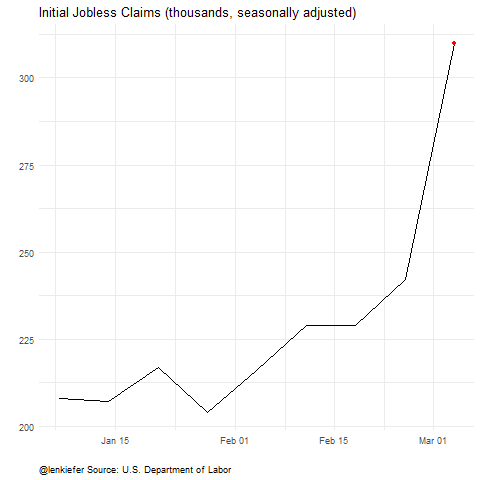
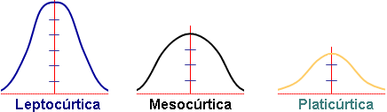

```{r setup, include=FALSE}

library(learnr)

library(nycflights13)

knitr::opts_chunk$set(echo = TRUE,warning = FALSE, message = FALSE)
tutorial_options(exercise.timelimit = 120)


covidCantones <- read.csv("https://raw.githubusercontent.com/DFJL/Datasets/master/covidCantones.csv",sep= ";")

mobilityCR <- read.csv("https://raw.githubusercontent.com/DFJL/Datasets/master/mobilityCR.csv",sep= ";") 

claims <- read.csv("https://raw.githubusercontent.com/DFJL/Datasets/master/unemploymentClaims.csv", sep= ";")


```


## Análisis Exploratorio de datos


Una vez superadas las etapas de definición del problema,adquisición y limpieza de la data, nos enfrentamos a la etapa de comenzar a analizar los datos en función del problema que se requiere resolver.

De esta manera, es aconsejable, iniciar desde lo sencillo, es decir, **obteniendo estadísticos univariados** (media, mediana, variabilidad) para las variables importantes del conjunto de datos, hasta realizar otros análisis exploratorios más complejos para **medir y visualizar patrones en la forma de los datos**, cerrando con análisis **bivariado o multivariado** para encontrar asociaciones o correlaciones en los datos.

En este tutorial vamos a ver los siguientes tópicos para ejecutar un análisis exploratorio de datos.

- Obtención de métricas básicas (medidas de tendencia central y variabilidad).
- Detección de valores nulos e información sobre las variables.
- Distribuciones de Frecuencia.
- Histogramas
- Boxplots.
- Valores extremos (outliers).
- Formas de las distribuciones.

## 1: Obtención de estadísticos básicos


En R base, podemos utilizar dos funciones sencillas para obtener información relevante del conjunto de datos que se está analizando.La función `str` indica la forma del dataframe en cuanto a total de filas y columnas y a su vez indica el tipo de datos de cada columna.La función `summary` brinda rápidamente estadísticos básicos de las variables del conjunto de datos, en función del tipo de datos de la columna.

```{r 1, exercise=TRUE}


# Lectura de archivo de datos de covid cantones

covidCantones <- read.csv("https://raw.githubusercontent.com/DFJL/Datasets/master/covidCantones.csv",sep= ";")

str(covidCantones)

summary(covidCantones)

```

A su vez, la función `glimpse` del paquete `dplyr`, brinda una funcionalidad similar a `str`:

```{r 2, exercise=TRUE}

library(dplyr)
glimpse(covidCantones)

```


## 2: Detección de valores nulos e información sobre las variables

Vamos a empezar a utilizar un paquete nuevo, especializado en el análisis exploratorio de datos llamado `dlookr`.La primera función `diagnose` imprime información valiosa sobre el conjunto de datos, sobre todo al respecto de los "missin values" o valores perdidos:

```{r 3, exercise=TRUE}

library(dlookr)
library(dplyr)

diagnose(covidCantones)

```


Las columnas del objeto  `tbl_df` retornado por la función `diagnose´ son las siguientes:

- `variables` : nombre de la columna.
- `types` : el tipo de datos de la columna.
- `missing_count` : número de valores nulos.
- `missing_percent` : % de valores nulos.
- `unique_count` : Número de valores únicos.
- `unique_rate` : % de valores únicos.Definido como `unique_count` / number of observation

**Valores perdidos (NA)** : Variables con valores altos de valores perdidos (% cercano a 100), deberían ser excluídos del análisis.

**Valores únicos** : Valores con un valor único (unique_count = 1) deberían  ser eliminadas del análisis de datos, ya que son constantes.


**Su Turno**

Utilizando el dataset `flights` del paquete `nycflights13` y el paquete `dlookr` identifique cuáles variables tienen valores nulos.

```{r T1, exercise=TRUE}


```

```{r T1-hint,exercise.lines = 20}

# Solamente digite `flights` para llamar el dataset en el ambiente R( ya se encuentra precargado luego de cargar la librería  `nycflights13`)

```


La función `diagnose_numeric` analiza solamente las variables detectadas como numéricas en R ( es decir variables posiblemente cuantitativas).

```{r 4, exercise=TRUE}

library(dlookr)
library(dplyr)

diagnose_numeric(covidCantones)

```


Las columnas del objeto  `tbl_df` retornado por la función `diagnose_numeric´ son las siguientes:

- `min` : Valor mínimo
- `Q1` : 1/4 quartil, 25avo percentil
- `mean` : media aritmética
- `median` : mediana, 50avo percentil
- `Q3` : 3/4 quartil, 75avo percentil
- `max` : Valor máximo
- `zero` : Número de obs con valor de cero.
- `minus` : Número de obs con valores negativos.
- `outlier` : Número de valores extremos.


La función `diagnose_category` analiza solamente las variables detectadas como categóricas en R ( es decir variables posiblemente cualitativas).

```{r 5, exercise=TRUE}

library(dlookr)
library(dplyr)

diagnose_category(covidCantones)

```


Las columnas del objeto  `tbl_df` retornado por la función `diagnose_category´ son las siguientes:

- `variables` : Nombre de las columnas.
- `levels`: Categorías de la columna.
- `N` : Número de observaciones.
- `freq` : Número de observaciones para la categoría.
- `ratio` : % de Observaciones para la categoría.
- `rank` : Posición de la categoría según `ratio`.


Como se puede observar en el resultado anterior, la tabla se vuelve muy grande ya que mezcla todas las variables cualitativas y sus categorías en una sola tabla.Sin embargo, las funciones del paquete `dlook` se pueden mezclar con `dplyr` y el operador `%>%` para realizar operaciones sobre los datos y modificar el resultado según nuestra necesidad.

A continuación se ejemplificará lo anteriromente mencionado filtrando solamente para la variable provincia:

```{r 5-1, exercise=TRUE}

library(dlookr)
library(dplyr)

diagnose_category(covidCantones) %>%
  filter(variables=="Province")

```


**Su Turno**

- Utilizando el dataset `flights` del paquete `nycflights13` y el paquete `dlookr` realice el diagnóstico de las variables cualitativas del dataset.
- Seguidamente, filtre para obtener el análisis solamente de la variable `dest`

```{r T2, exercise=TRUE}


```


## 3: Distribuciones de Frecuencia (Variables Cualitativas)

En la clase anterior vimos como realizar distribuciones de frecuencia para variables categóricas con el paquete `dplyr`.

Las distribuciones de frecuencias son resumenes de las variables analizadas en función de sus categorías.Se obtiene usualmente el conteo de las observaciones, el % de las observaciones y el % acumulado de las categorías(ordenando las categorías).Con la función `diagnose_category` tuvimos una aproximación a lo anterior, sin embargo a continuación vamos a realizar más formalmente una distribución de frecuencias para variables categóricas.

```{r 6, exercise=TRUE}

library(dlookr)
library(dplyr)

provincia <- covidCantones %>%
  group_by(Province) %>%
  summarise(Freq = sum(Cases)) %>%
  mutate(relFreq = prop.table(Freq),
         Cumulative_Freq = cumsum(Freq),
         Cumulative_Relative_Freq = cumsum(relFreq)
         )

provincia

```

## 4: Distribuciones de Frecuencia (Variables Cuantitativas)

Para **variables cuantitativas** se realiza  un tratamiento especial ya que se deben crear rangos  de la variable para poder agrupar y realizar la distribución de frecuencias.


Para crear distribuciones de frecuencia de variables cuantitativas, podemos utilizar la función `binning`.

`binning()` soporta los siguientes métodos para dicha transformación:


- `"`quantile"` : categoriza usando los cuantiles para obtener la misma frecuencia.
- `"equal"` : categoriza para obtener el mismo tamaño de los grupos.
- `"pretty"` :categoriza en segmentos moderadamente "buenos.
- `"kmeans"` : categoriza utilizando técnicas avanzadas de minería de datos(clustering).
- `"bclust"` : categoriza utilizando técnicas avanzadas de minería de datos(clustering).

```{r 7, exercise=TRUE}

library(dlookr)
library(dplyr)

binEqual <- binning(covidCantones$Cases,type = "equal")


binEqual


```

```{r 8, exercise=TRUE}

library(dlookr)
library(dplyr)

binEqual <- binning(covidCantones$Cases,type = "equal")

# Se puede jugar con las opciones de binning
binPretty1 <- binning(covidCantones$Cases,
                     type = "pretty")

binPretty2 <- binning(covidCantones$Cases,
                     type = "pretty",
                     nbins = 4,
                     labels =c("Menos de 20 Casos", "20-40 Casos", "40-60 Casos", 
                               "60-80 Casos","Mas de 80 Casos") 
                     )


binPretty1;binPretty2

# La función summary(bin) realiza una distribución de fecuencias de los bines

summary(binPretty2)


```


**Usando dplyr**


```{r 9, exercise=TRUE}

library(dlookr)
library(dplyr)


provinciasDist <- covidCantones %>%
  mutate(bin = binning(covidCantones$Cases,type = "pretty")) %>%
  group_by(bin) %>%
  summarise(Freq = n()) %>%
  mutate(relFreq = prop.table(Freq),
         Cumulative_Freq = cumsum(Freq),
         Cumulative_Relative_Freq = cumsum(relFreq)
         )

provinciasDist

```


## 5: Histogramas

Una manera conveniente y gráfica de analizar las distribuciones de frecuencia son los histogramas.Los histogramas son gráficos de barra especiales en los cuáles los intervalos de clase o bines se encuentra en el eje x y en el eje y se encuentra la frecuencia(ya sea absoluta o relativa) de la variable analizada.

Veamoslo con un ejemplo de los datos de covid que venimos analizando, con el paquete `dlookr` :

```{r 10, exercise=TRUE}

library(dlookr)
library(dplyr)

# Volvamos a calcular la distribución de frecuencias


binPretty2 <- binning(covidCantones$Cases,
                     type = "pretty",
                     nbins = 4,
                     labels =c("Menos de 20 Casos", "20-40 Casos", "40-60 Casos", 
                               "60-80 Casos","Mas de 80 Casos") 
                     )


binPretty2

#Con el paquete dlookr podemos usar solamente la función plot sobre los bines y rápidamente tenemos el histograma

plot(binPretty2, sub = "Costa Rica: Histograma de los casos de Covid-19 por cantón")

```


## 6: Boxplots

Continuando con las visualizaciones para realizar análisis exploratorio de datos, el boxplot provee muchisima información de las variables cuantitativas.


El siguiente es un ejemplo de un boxplot:


Como se puede observar, el boxplot permite visualizar en un mismo gráfico información sobre la distribución de los datos, valores centrales como la mediana y la media( no incluída en el ejemplo) , los cuartiles, el rango intercuartil, valores mínimos y máximos y posibles valores extremos.

Con el R base, podemos crear boxplots con mucha flexibilidad.Para este ejemplo utilizaremos el archivo de datos movilidad en Costa Rica en el año 2020 producto del COVID-19:

```{r 11, exercise=TRUE}

library(dlookr)
library(dplyr)

mobilityCR <- read.csv("https://raw.githubusercontent.com/DFJL/Datasets/master/mobilityCR.csv",sep= ";") 

# Tomamos un vistazo a los datos
glimpse(mobilityCR)

# Delimitando el dataframe, procedemos a dibujar el boxplot para la variable  `workplaces_percent_change_from_baseline`:

boxplotCR<- boxplot(mobilityCR$workplaces,
        main = "Costa Rica:Cambio porcentual diario de estancias en lugares de trabajo, con respecto a línea base 2019",
        xlab = "Cambio porcentual(línea base 2019)",
        ylab = "workplaces",
        col = "orange",
        border = "brown",
        horizontal = TRUE
)

boxplotCR


```


De igual manera, se pueden comparar varios grupos o variables en un mismo boxplot, a efectos de poder visualizar fácilmente varios elementos y poder comparar.Solamente se agrega la nueva variable en la función:


```{r 12, exercise=TRUE}


boxplotCR2<- boxplot(mobilityCR$workplaces,
                     mobilityCR$residential,
                     main = "Costa Rica:Cambio porcentual diario, con respecto a línea base 2019",
                     at = c(1,2),
                     names = c("workplaces","residential"),
                     col = c("orange","lightblue"),
                     border = "brown",
                     horizontal = TRUE
                     )

print(boxplotCR2)


```


Que pasa si queremos comparar varios boxplots, pero en lugar de utilizar columnas de una dataframe, queremos comparar grupos de una sola columna? Por ejemplo, queremos comparar el cambio en residencias por mes.Para esto podemos utilizar la sintaxis de las fórmulas de R (`~`):


```{r 13, exercise=TRUE}


boxplotCR3<- boxplot(residential~month,
                     data=mobilityCR,
                     main="Cambio porcentual de estancia promedio residencial por mes",
                     xlab="Mes",
                     ylab="Cambio Porcentual",
                     col="orange",
                     border="brown"
                     )

print(boxplotCR3)


```

Notese que los dos anteriores boxplots pertenecen al espectro del **Análisis Exploratorio Bivariado**, ya que se considera el cruce de dos variables para obtener patrones y relaciones entre estas.

Todo el análisis anterior a esto, es considerado **Análisis Exploratorio Univariado**

**Su Turno**

- Utilizando el dataset `mobilityCR` dibuje un boxplot por mes para la variable `workplaces_percent_change_from_baseline`

```{r T3, exercise=TRUE}


```

Puede visualizar mas ejemplos en el siguiente vinculo

[boxplots](https://www.datamentor.io/r-programming/box-plot/)


## 7: Outliers

Como hemos podido identificar en algunos de los resultados anteriores como los boxplots, es importante identificar outliers de un conjunto de datos para tomar decisiones sobre que hacer con estos.Los outliers o valores atípicos, como su nombre lo indica, son valores que se salen de los rangos donde están concentrados la mayor cantidad de datos, tanto en el extremo inferior como en el extremo superior.



Para ejemplificar el uso de outliers vamos a volver al paquete `dlookr`, ya que cuenta con herramientas sencillas para su identificación y tratamiento:


la función `diagnose_outlier()` crea un resumen con diversas métricas con respecto a los outliers:

```{r 14, exercise=TRUE}


library(dlookr)
library(scales)
library(dplyr)


outliers <-diagnose_outlier(claims) %>%
  mutate(outliers_ratio= percent(outliers_ratio/100,accuracy = 2))

outliers

```


Las variables del output  `tbl_df` retornado por  `diagnose_outlier()` son las siguientes:

- `outliers_cnt` : Cantidad de outliers
- `outliers_ratio` : Porcentaje de outliers
- `outliers_mean` : Promedio de los outliers en la variable
- `with_mean` : Promedio de la variable con outliers
- `without_mean` : Promedio de la variable sin outliers


**Visualización de outliers usando `plot_outlier()`**

Esta función permite visualizar los outliers de las variables numéricas de un dataframe.El uso es igual al de la función `diagnose()`

El gráfico derivado del uso de la función tiene los siguientes resultados:

- Gráfico del boxplot con outliers.
- Gráfico del boxplot sin outliers.
- Histograma con outliers
- Histograma sin outliers.

```{r 15, exercise=TRUE}


library(dlookr)
library(scales)
library(dplyr)

#Paso 1 Se crea un dataframe del dataframe flights solo con las variables cuyo % es mayor a .5

outliersVars <- diagnose_outlier(claims) %>% 
                 filter(outliers_ratio >= 0.01) %>% 
                 select(variables) %>% 
                 unlist()

#Paso 2 Se gráfica sobre el dataframe previamente calculado

plot_outlier(claims,outliersVars)


```


## 8: Entendiendo la forma de los datos

Los histogramas son muy importantes para entender la forma o distribución de los datos analizados.Estos son una aproximacion a la verdadera curva de la distribución de los datos.Es importante analizar estas distribuciones ya que usualmente deben ser similares a modelos teoricos matematicos a efectos de poder ajustar a modelos estadísticos más avanzados e inferenciales como el análisis de regresión entre otros.

El siguiente video introducirá dos conceptos hasta el momento no estudiados importantes de conocer a efectos de realizar el diagnóstico de lo comentado en el párafo anterior:

- **distribución normal**.
- **asimetría**.


{width="90%"}

**Valores de la asimetría (g1)**

- **(g1 = 0)**: Se acepta que la distribución es Simétrica, es decir, existe aproximadamente la misma cantidad de valores a los dos lados de la media. Este valor es difícil de conseguir por lo que se tiende a tomar los valores que son cercanos ya sean positivos o negativos (± 0.5).

- **(g1 > 0)**: La curva es asimétricamente positiva por lo que los valores se tienden a reunir más en la parte izquierda que en la derecha de la media.

- **(g1 < 0)**: La curva es asimétricamente negativa por lo que los valores se tienden a reunir más en la parte derecha de la media

Adicionalmente la **curtosis**, no mencionada en el video,es una medida de forma que mide cuán achatada está una curva o distribución.

Esta medida determina el grado de concentración que presentan los valores en la región central de la distribución. Por medio del Coeficiente de Curtosis, podemos identificar si existe una gran concentración de valores (Leptocúrtica), una concentración normal (Mesocúrtica) ó una baja concentración (Platicúrtica).

- Una curtosis de la muestra que se desvía significativamente de 0 puede indicar que los datos no están distribuidos normalmente



**Valores de la curtosis (g2)**

**(g2 = 0)** la distribución es Mesocúrtica: Al igual que en la asimetría es bastante difícil  encontrar un coeficiente de Curtosis de cero (0), por lo que se suelen aceptar los valores cercanos (± 0.5 aprox.).

**(g2 > 0)** la distribución es Leptocúrtica

**(g2 < 0)** la distribución es Platicúrtica


Con `dlookr`, podemos utilizar a función `describe(df)`, para poder obtener la curtosis y la asimetría(skewness)

```{r 16, exercise=TRUE}


library(dlookr)
library(dplyr)

describe(covidCantones)


```


Usando a su vez `dplyr`, se pueden ordenar y seleccionar las variables con mayor asimetría:

```{r 17, exercise=TRUE}

library(dlookr)
library(dplyr)


covidCantones %>%
  describe() %>%
  select(variable, skewness, mean, p25, p50, p75) %>% 
  filter(!is.na(skewness)) %>% 
  arrange(desc(abs(skewness)))


```

