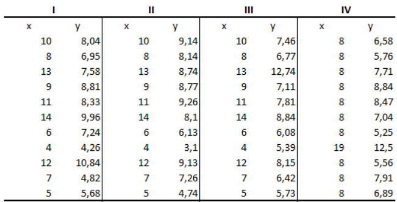

```{r setup, include=FALSE}
knitr::opts_chunk$set(echo = TRUE)
```

# Instrucciones

- Genere un documento R markdown para resolver los ejercicios.
- En su documento R markdown, incluya como texto el enunciado del ejercicio y en el chunk incluya el código y los resultados.

- Publique en Rpubs (**Investigar**) el documento renderizado con los las funciones requeridas y resultados (impresos en el reporte) para resolver los ejercicios.

# Ejercicios

1- Para el laboratorio se van a utilizar los datos de los siguientes 4 datasets:



2- Escoger **individualmente** 1 de los 4 datasets.

3- Para el dataset escogido, calcular:

- Media
- Desviación estándar
- Correlación de x e y.

4- Crear  el scatterplot de x e y, con cada variable en su correspondiente eje.

5- Juntarse con tres compañeros que hayan escogido datasets diferentes(no se puede repetir datasets a menos que no hayan más opciones de compañeros).

6- Analizar conjuntamente todos los resultados y concluir.

**Reglas**

1- Este trabajo se toma en cuenta como puntos de una tarea.

2- El grupo con el mejor script(en términos de orden, estructura y documentación) e interpretación y análisis gana 3 puntos adicionales en la nota.

3- No se puede trabajar individualmente.
