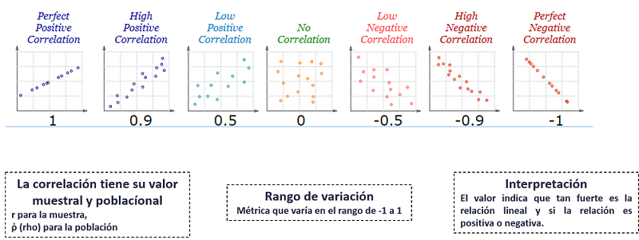

```{r setup, include=FALSE}

library(learnr)
library(lubridate)
library(dplyr)
knitr::opts_chunk$set(echo = TRUE,warning = FALSE, message = FALSE,fig.width =10 , fig.height = 8)

ventas <- data.frame(temperatura=c(14.2,16.4,11.9,15.2,18.5,22.1,19.4,25.1,23.4,18.1,22.6,17.2),
                     ventas=c(215,325,185,332,406,522,412,614,544,421,445,408)
                     )


covidCantones <- read.csv("https://raw.githubusercontent.com/DFJL/Datasets/master/covidCantones.csv",sep= ";")

mobilityCR <- read.csv("https://raw.githubusercontent.com/DFJL/Datasets/master/mobilityCR.csv",sep= ";") 

claims <- read.csv("https://raw.githubusercontent.com/DFJL/Datasets/master/unemploymentClaims.csv", sep= ";")

claims$date <- as.Date(claims$Filed.week.ended, format = '%m/%d/%Y')

# Creamos nuevas variables sobre el dataframe
claims <- claims %>%
  mutate(ClaimsRate = round(Continued.Claims/Covered.Employment*100,2),
         month = as.factor(month(date,label = TRUE)),
         year = as.factor(year(date)),
         UnemploymentRate = factor(ifelse(State %in% c('Michigan','Nevada'),
                                          "High","Low"
                                          )
                                   )
         )

# Se genera un dataframe versión light para varios análisis

claimsTidy <- claims %>%
  filter( State %in% c('Connecticut','Minnesota','Florida','Nevada','Michigan') & year(date)==2020) 

```


## Introducción a la correlación

La correlación es el grado es **asociación lineal** entre dos variables cuantitativas.Este concepto mide que tan fuerte es la relación lineal entre dos variables cuantitativas.Es decir, si una variable aumenta, la otra tiende a aumentar sus valores también; si una variable disminuye sus valores, la otra también tiende a disminuir.

La correlación **no implica** causalidad, es decir, una vez que dos variables cuentan con alta correlación no se puede asumir que una es causa de la otra o viceversa.Para comprobar esto, se deben realizar otro tipo de pruebas estadísticas.

Para ejemplificar el concepto de correlación, vamos a cargar en r los datos de venta total de helados de una tienda, ya que su dueño tiene la sospecha de que estas están siendo afectadas por el nivel de temperatura del día:

```{r 1, exercise=TRUE}

# Se cargan los datos en un dataframe de R

ventas <- data.frame(temperatura=c(14.2,16.4,11.9,15.2,18.5,22.1,19.4,25.1,23.4,18.1,22.6,17.2),
                     ventas=c(215,325,185,332,406,522,412,614,544,421,445,408)
                     )

# Visualizamos el dataframe

ventas

# Vemos la estructura de los datos

str(ventas)


```

## Scatterplot

Inicialmente, podemos visualizar con R el grado de asociación entre las dos variables con un gráfico llamado scatterplot.El scatterplot, ubica en el eje y e x cada una de las variables y en el gráfico cruza las observaciones.Vamos a utlizar la función `plot` de manera rápida para crear el gráfico:

```{r 2, exercise=TRUE}

plot(x= ventas$temperatura, y = ventas$ventas , 
     main = "Scatterplot entre venta de helados y temperatura",
     xlab = "Temperatura", 
     ylab = "Ventas diarias",
     pch = 19, frame = FALSE)

```

Según el anterior gráfico, podemos visualizar fácilmente, que existe un grado de asocación fuerte entre las dos variables.En este caso, a mayor temperatura, existe una tendencia de mayor ventas totales de helados.Cuál puede ser la lógica de esto?

La relación anterior se le llama **correlación positiva o directa**, debido a que ambas variables aumentan conforme la otra aumenta.

La correlación también se puede medir con un indicador, para estimar el grado de fuerza de la relación entre las variables.

## Coeficiente de correlación

En R, podemos facilmente calcular el indicador de  correlación con la función `cor`:

```{r 3, exercise=TRUE}

cor(ventas$temperatura,ventas$ventas)

```

En este caso, la correlación tiene un valor de `r cor(ventas$temperatura,ventas$ventas)`.Para interpretar este valor, vamos a seguir la guía del siguiente diagrama, con respecto al intervalo de variación del coeficiente de correlación:



No obstante, se debe tener precaución de dicha guía, ya que según el área científica de acción del problema, un valor de correlación puede ser alto o bajo según ese contexto.Por ejemplo, en ciencias sociales, un valor cercano a 0.5 puede ser considerado alto, mientras que en química puede ser considerado bajo.

## Precauciones de la correlación con datos no lineales

Supongamos, que los datos de la tienda eran parciales.El vendedor agrega más datos de un mes que estuvo muy caliente y se obtienen los siguientes resultados:

```{r 4, exercise=TRUE}

library(dplyr)

# Se agregan los datos faltantes

ventasFaltantes <- data.frame(temperatura=c(27.2,32.4,22,30.3,36,38,33,36.5,28,32.2,32.6,40),
                     ventas=c(500,250,525,450,200,222,189,300,425,375,368,100)
                     )

# Se agregan al dataframe original los datos nuevos

ventasCompleto <- ventas %>%
  bind_rows(ventasFaltantes)

# Se realiza de nuevo el scatterplot

plot(x= ventasCompleto$temperatura, y = ventasCompleto$ventas , 
     main = "Scatterplot entre venta de helados y temperatura",
     xlab = "Temperatura", 
     ylab = "Ventas diarias",
     pch = 19, frame = FALSE)

# Se obtiene el grado de asociación lineal

cor(x= ventasCompleto$temperatura, y = ventasCompleto$ventas)

```

En este caso, según el gráfico, se puede observar que la relación no es lineal, ya que a partir de cierto punto de temperatura, las ventas caen, hipotéticamente porque las personas no salen por las extremas temperaturas.

Más información de scatterplots con R base [aqui](http://www.sthda.com/english/wiki/scatter-plots-r-base-graphs)

## Matriz de correlaciones

Hasta el momento hemos visualizado y medido el grado de correlación entre dos variables.Pero que pasa si tenemos un conjunto de datos con muchas variables y queremos conocer y visualizar fácilmente la relación lineal de todas las combinaciones de las variables.Para esto podemos calcular la matriz de correlaciones:

```{r 5, exercise=TRUE}

library(dplyr)

# Cargamos el archivo de mobility

mobilityCR <- read.csv("https://raw.githubusercontent.com/DFJL/Datasets/master/mobilityCR.csv",sep= ";")

# Seleccionamos solamente las variables de interes (solamente queremos los % de cambio de movilidad)

varCor <- mobilityCR %>%
  select(retail_and_recreation:residential)

# Calculamos la matriz de correlación y redondeamos los valores

round(cor(varCor),2)

```

Notese que en la diagonal siempre da un valor de 1, debido a que es la correlación de la variable contra ella misma, por lo que la correlación siempre será perfecta.

Una alternativa, es utilizar la función `correlate`, del paquete `dlookr`:

```{r 6, exercise=TRUE}

library(dplyr)
library(dlookr)

# Cargamos el archivo de mobility

mobilityCR <- read.csv("https://raw.githubusercontent.com/DFJL/Datasets/master/mobilityCR.csv",sep= ";")

# Seleccionamos solamente las variables de interes (solamente queremos los % de cambio de movilidad)

varCor <- mobilityCR %>%
  select(retail_and_recreation:residential)

# Calculamos la matriz de correlación y redondeamos los valores

correlate(varCor)

```


**Su turno**

- Utilizando el dataset `covidCantones` cree la matriz de correlaciones de las variables cuantitativas( Cases, Deaths y Recoveries).

```{r T1, exercise=TRUE}

#Aqui su código

```


```{r T1-hint,exercise.lines = 20}

#covidCantones <- read.csv("https://raw.githubusercontent.com/DFJL/Datasets/master/covidCantones.csv",sep= ";")

```

**Visualizar la matriz de correlación utilizando `plot_correlate()`**

```{r 7, exercise=TRUE}

library(dplyr)
library(dlookr)

# Cargamos el archivo de mobility

mobilityCR <- read.csv("https://raw.githubusercontent.com/DFJL/Datasets/master/mobilityCR.csv",sep= ";")

# Seleccionamos solamente las variables de interes (solamente queremos los % de cambio de movilidad)

varCor <- mobilityCR %>%
  select(retail_and_recreation:residential)

# Calculamos la matriz de correlación y redondeamos los valores

plot_correlate(varCor)

```

Este gráfico es muy conveniente para visualizar en un solo gráfico, la relación entre todas las variables cuantitativas. En este caso, la escala de color indica el rango de variación del coeficiente de correlación, desde valores negativos(escala de rojos) hasta positivos (escala azul).También la forma de cada celda indica la fuerza de la correlación.Elipses más gruesas indican correlaciones más débiles y las más delgadas una correlación mas fuerte.


Esta función también soporta los verbos de `dplyr`, por ejemplo el group by para visualizar la matriz por grupos:

```{r 8, exercise=TRUE}

library(dplyr)
library(dlookr)

# Cargamos el archivo de mobility

mobilityCR <- read.csv("https://raw.githubusercontent.com/DFJL/Datasets/master/mobilityCR.csv",sep= ";")


# Calculamos la matriz de correlación y agrupamos por mes

mobilityCR %>%
  select(retail_and_recreation:residential,month) %>%
  filter(month != 5) %>% # Eliminamos el mes 5 por tener pocos datos
  group_by(month) %>%
  plot_correlate(residential,-month) # se seleciona solo una variable para graficar contra el resto

```


## Correlación no significa causalidad

{width="90%"}

## AED Basado en una variable objetivo

Usualmente, cuando planteamos un problema de análisis de datos, desde la etapa de definición del problema queremos conocer el comportamiento y patrones de una variable objetivo y el efecto sobre esta de otras variables.

Este análisis se realiza de manera diferente en función del tipo de variable ( cualitativa o cuantitativa) de la variable objetivo (Y) y la variable "Explicativa" (X).A continuación mostraremos una guía del análisis para cada una de estas alternativas.

### Variable objetivo Cualitativa

Vamos a utilizar el dataframe de claims que hemos venido utilizando, pero primeramente vamos a crear algunas operaciones para focalizar y ejemplificar el análisis:


```{r 9, exercise=TRUE}

library(dplyr)
library(dlookr)

# Cargamos el archivo de claims

claims <- read.csv("https://raw.githubusercontent.com/DFJL/Datasets/master/unemploymentClaims.csv", sep= ";")

claims$date <- as.Date(claims$Filed.week.ended, format = '%m/%d/%Y')

# Creamos nuevas variables sobre el dataframe
claims <- claims %>%
  mutate(ClaimsRate = round(Continued.Claims/Covered.Employment*100,2),
         month = as.factor(month(date,label = TRUE)),
         year = as.factor(year(date)),
         UnemploymentRate = factor(ifelse(State %in% c('Michigan','Nevada'),
                                          "High","Low"
                                          )
                                   )
         )

# Se genera un dataframe versión light para varios análisis

claimsTidy <- claims %>%
  filter( State %in% c('Connecticut','Minnesota','Florida','Nevada','Michigan') & year(date)==2020) 

glimpse(claimsTidy)

```

**Objetivo Cualitativa/ Explicativa Cuantitativa**

Podemos utilizar la función `relate` del paquete `dlookr`, para inicializar el análisis.Esta función muestra la relación entre la variable objetivo y la variable Explicativa.

Para utilizar la función `relate`, primeramente se debe utilizar la función `target_by`, para componer el tipo de relación a explorar:

```{r 10, exercise=TRUE}

library(dplyr)
library(dlookr)

claimsCut <- claims %>%
  filter(ClaimsRate<5)

categ <- target_by(.data = claimsCut,target = UnemploymentRate)

cat_num <- relate(categ, ClaimsRate)

cat_num

plot(cat_num)

```

El resultado anterior, podemos ver un nuevo tipo de gráfico, llamado **"gráfico de densidad"**, que es una suavización de las distribución de frecuencia.En el eje Y tiene la densidad, en este caso el porcentaje de observaciones y en el eje X la variable Explicativa, en este caso `ClaimsRate`. 

**Objetivo Cualitativa/ Explicativa Cualitativa**

En este caso el proedimiento es el mismo, solo debemos cambiar las variables y consecuentemente los resultados serán en función del tipo de variable:

```{r 11, exercise=TRUE}

library(dplyr)
library(dlookr)

# En este caso vamos a crear una variable cualitativa con los claimRate

claimsCut <- claims %>%
  mutate(claimsRateGroup = factor(ifelse(ClaimsRate<1,"1-Low","2-High"))) 

categ <- target_by(.data = claimsCut,target = claimsRateGroup)

cat_cat <- relate(categ, year)

cat_cat

plot(cat_cat)

# Alternativamente
claimsCut %>%
  target_by(target = claimsRateGroup) %>%
  relate(year) %>%
  plot()

```

### Variable objetivo Cuantitativa

Cuando la variable objetivo es cuantitativa, el tipo de análisis varía significativamente.

**Objetivo Cuantitativa/ Explicativa Cualitativa**


```{r 12, exercise=TRUE}

library(dplyr)
library(dlookr)

# En este caso vamos a utilizar claimsRate como variable objetivo

num <- target_by(.data = claimsTidy,target = ClaimsRate)

num_cat <- relate(num, State)

num_cat

plot(num_cat)

```

**Objetivo Cuantitativa/ Explicativa Cuantitativa**

Para este caso, vamos a volver al dataframe de ventas de helado:

```{r 13, exercise=TRUE}

library(dplyr)
library(dlookr)

# En este caso vamos a utilizar claimsRate como variable objetivo

num <- target_by(.data = ventas,target = ventas)

num_num <- relate(num, temperatura)

num_num

plot(num_num)

```


En este último caso, la función ajusta por defecto un **modelo de regresión lineal**, en donde se está intentando explicar o predecir la variable Y en función de la variable X.