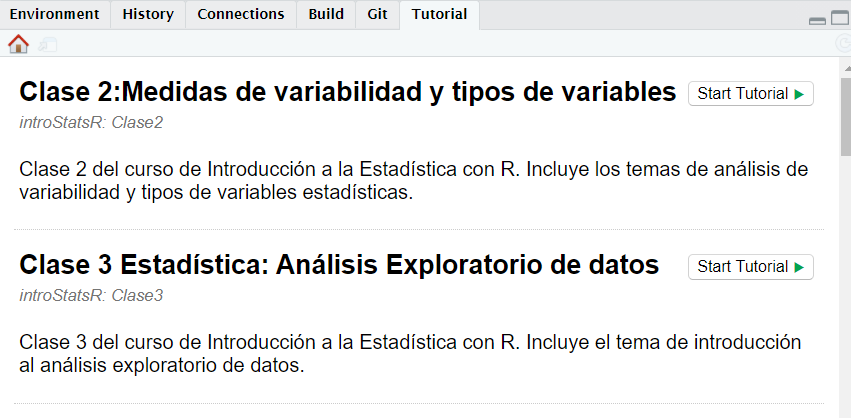

# TEC Introducción a Estadística <a href="url"></a>

El paquete `introStatsR` contiene tutoriales y materiales para el curso
del Técnico de Análisis de Datos del Instituto Tecnológico de Costa
Rica.

En dichos tutoriales, podrá comprender los temas estadísticos básicos en
el ambiente de R, ya sea de manera sincrónica o asincronica,
experimentando y comprobando sus conocimientos directamente en los
tutoriales disponibles.

A este momento, el paquete contiene 5 tutoriales con la siguiente
temática:

| Totorial | Contenido                                               | Link ShinyApps                                             |
| -------- | ------------------------------------------------------- | ---------------------------------------------------------- |
| Clase 2  | Medidas de variabilidad y tipos de variable             | [Clase2](https://dfjl1986.shinyapps.io/claseEstadistica2/) |
| Clase 3  | Introducción al análisis exploratorio de datos          | [Clase3](https://dfjl1986.shinyapps.io/claseEstadistica3/) |
| Clase 4  | Introducción al análisis exploratorio de datos(Parte 2) | [Clase4](https://dfjl1986.shinyapps.io/claseEstadistica3/) |
| Clase 5  | Análisis de correlación                                 | [Clase5](https://dfjl1986.shinyapps.io/claseEstadistica4/) |
| Clase 6  | Introducción a la visualización de datos con `ggplot2`  | [Clase6](https://dfjl1986.shinyapps.io/claseEstadistica6/) |

## Instalación

``` r
remotes::install_github("DFJL/IntroStatsR")
```

Una vez instalado, puede cargar el paquete con la siguiente instrucción:

``` r

library(IntroStatsR)
```

## Utilizar los tutoriales

Para poder empezar a utilizar los tutoriales,se puede realizar mediante
dos formas

  - Mediante instrucción:

<!-- end list -->

``` r

learnr::run_tutorial(name = "Clase2", package = "introStatsR")
```

``` r


# Mostrar todos los tutoriales 
learnr::available_tutorials("introStatsR")
#> Available tutorials:
#> * introStatsR
#>   - Clase2 : "Clase 2:Medidas de variabilidad y tipos de variables"
#>   - Clase3 : "Clase 3 Estadística: Análisis Exploratorio de datos"
#>   - Clase4 : "Clase 4 Estadística: Análisis Exploratorio de datos (Parte 2)"
#>   - Clase5 : "Clase Estadística 5: Correlación"
#>   - Clase6 : "Clase Estadística 6: Introducción a la visualización de datos"
```

  - Mediante la interfaz de usuario de Rstudio:

Al cargar el paquete, tendrá disponible en la pestalla llamada
**Tutorial** la lista de tutoriales del paquete ( y de otros paquetes
que cuenten con tutoriales) y haciendo click al botón **Start Tutorial**
podrá iniciar el tutorial seleccionado:


