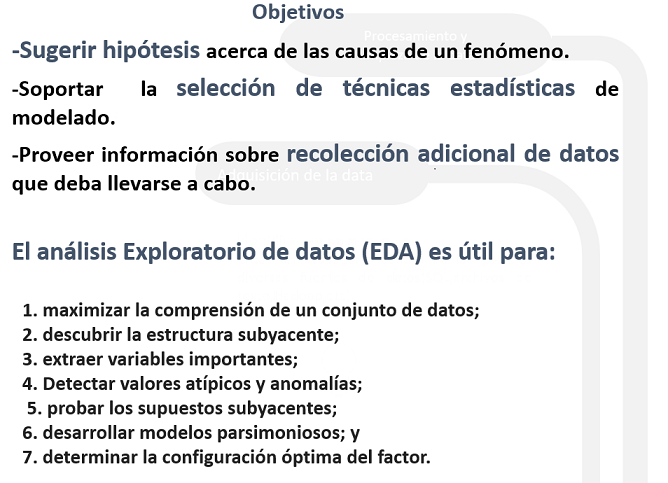

```{r setup, include=FALSE}

library(learnr)

library(nycflights13)

knitr::opts_chunk$set(echo = TRUE,warning = FALSE, message = FALSE)
tutorial_options(exercise.timelimit = 120)


covidCantones <- read.csv("https://raw.githubusercontent.com/DFJL/Datasets/master/covidCantones.csv",sep= ";")

mobilityCR <- read.csv("https://raw.githubusercontent.com/DFJL/Datasets/master/mobilityCR.csv",sep= ";") 

claims <- read.csv("https://raw.githubusercontent.com/DFJL/Datasets/master/unemploymentClaims.csv", sep= ";")


```


## Análisis Exploratorio de datos



Una vez superadas las etapas de definición del problema,adquisición y limpieza de la data, nos enfrentamos a la etapa de comenzar a analizar los datos en función del problema que se requiere resolver.

De esta manera, es aconsejable, iniciar desde lo sencillo, es decir, **obteniendo estadísticos univariados** (media, mediana, variabilidad) para las variables importantes del conjunto de datos, hasta realizar otros análisis exploratorios más complejos para **medir y visualizar patrones en la forma de los datos**, cerrando con análisis **bivariado o multivariado** para encontrar asociaciones o correlaciones en los datos.

En este tutorial vamos a ver los siguientes tópicos para ejecutar un análisis exploratorio de datos.

- Obtención de métricas básicas (medidas de tendencia central y variabilidad).
- Detección de valores nulos e información sobre las variables.
- Distribuciones de Frecuencia.
- Histogramas
- Boxplots.
- Valores extremos (outliers).
- Formas de las distribuciones.

## 1: Obtención de estadísticos básicos


En R base, podemos utilizar dos funciones sencillas para obtener información relevante del conjunto de datos que se está analizando.La función `str` indica la forma del dataframe en cuanto a total de filas y columnas y a su vez indica el tipo de datos de cada columna.La función `summary` brinda rápidamente estadísticos básicos de las variables del conjunto de datos, en función del tipo de datos de la columna.

```{r 1, exercise=TRUE}


# Lectura de archivo de datos de covid cantones

covidCantones <- read.csv("https://raw.githubusercontent.com/DFJL/Datasets/master/covidCantones.csv",sep= ";")

str(covidCantones)

summary(covidCantones)

```

A su vez, la función `glimpse` del paquete `dplyr`, brinda una funcionalidad similar a `str`:

```{r 2, exercise=TRUE}

library(dplyr)
glimpse(covidCantones)

```


## 2: Detección de valores nulos e información sobre las variables

Vamos a empezar a utilizar un paquete nuevo, especializado en el análisis exploratorio de datos llamado `dlookr`.La primera función `diagnose` imprime información valiosa sobre el conjunto de datos, sobre todo al respecto de los "missin values" o valores perdidos:

```{r 3, exercise=TRUE}

library(dlookr)
library(dplyr)

diagnose(covidCantones)

```


Las columnas del objeto  `tbl_df` retornado por la función `diagnose´ son las siguientes:

- `variables` : nombre de la columna.
- `types` : el tipo de datos de la columna.
- `missing_count` : número de valores nulos.
- `missing_percent` : % de valores nulos.
- `unique_count` : Número de valores únicos.
- `unique_rate` : % de valores únicos.Definido como `unique_count` / number of observation

**Valores perdidos (NA)** : Variables con valores altos de valores perdidos (% cercano a 100), deberían ser excluídos del análisis.

**Valores únicos** : Valores con un valor único (unique_count = 1) deberían  ser eliminadas del análisis de datos, ya que son constantes.


**Su Turno**

Utilizando el dataset `flights` del paquete `nycflights13` y el paquete `dlookr` identifique cuáles variables tienen valores nulos.

```{r T1, exercise=TRUE}


```

```{r T1-hint,exercise.lines = 20}

# Solamente digite `flights` para llamar el dataset en el ambiente R( ya se encuentra precargado luego de cargar la librería  `nycflights13`)

```


La función `diagnose_numeric` analiza solamente las variables detectadas como numéricas en R ( es decir variables posiblemente cuantitativas).

```{r 4, exercise=TRUE}

library(dlookr)
library(dplyr)

diagnose_numeric(covidCantones)

```


Las columnas del objeto  `tbl_df` retornado por la función `diagnose_numeric´ son las siguientes:

- `min` : Valor mínimo
- `Q1` : 1/4 quartil, 25avo percentil
- `mean` : media aritmética
- `median` : mediana, 50avo percentil
- `Q3` : 3/4 quartil, 75avo percentil
- `max` : Valor máximo
- `zero` : Número de obs con valor de cero.
- `minus` : Número de obs con valores negativos.
- `outlier` : Número de valores extremos.


La función `diagnose_category` analiza solamente las variables detectadas como categóricas en R ( es decir variables posiblemente cualitativas).

```{r 5, exercise=TRUE}

library(dlookr)
library(dplyr)

diagnose_category(covidCantones)

```


Las columnas del objeto  `tbl_df` retornado por la función `diagnose_category´ son las siguientes:

- `variables` : Nombre de las columnas.
- `levels`: Categorías de la columna.
- `N` : Número de observaciones.
- `freq` : Número de observaciones para la categoría.
- `ratio` : % de Observaciones para la categoría.
- `rank` : Posición de la categoría según `ratio`.


Como se puede observar en el resultado anterior, la tabla se vuelve muy grande ya que mezcla todas las variables cualitativas y sus categorías en una sola tabla.Sin embargo, las funciones del paquete `dlook` se pueden mezclar con `dplyr` y el operador `%>%` para realizar operaciones sobre los datos y modificar el resultado según nuestra necesidad.

A continuación se ejemplificará lo anteriromente mencionado filtrando solamente para la variable provincia:

```{r 5-1, exercise=TRUE}

library(dlookr)
library(dplyr)

diagnose_category(covidCantones) %>%
  filter(variables=="Province")

```


**Su Turno**

- Utilizando el dataset `flights` del paquete `nycflights13` y el paquete `dlookr` realice el diagnóstico de las variables cualitativas del dataset.
- Seguidamente, filtre para obtener el análisis solamente de la variable `dest`

```{r T2, exercise=TRUE}


```


## 3: Distribuciones de Frecuencia (Variables Cualitativas)

En la clase anterior vimos como realizar distribuciones de frecuencia para variables categóricas con el paquete `dplyr`.

Las distribuciones de frecuencias son resumenes de las variables analizadas en función de sus categorías.Se obtiene usualmente el conteo de las observaciones, el % de las observaciones y el % acumulado de las categorías(ordenando las categorías).Con la función `diagnose_category` tuvimos una aproximación a lo anterior, sin embargo a continuación vamos a realizar más formalmente una distribución de frecuencias para variables categóricas.

```{r 6, exercise=TRUE}

library(dlookr)
library(dplyr)

provincia <- covidCantones %>%
  group_by(Province) %>%
  summarise(Freq = sum(Cases)) %>%
  mutate(relFreq = prop.table(Freq),
         Cumulative_Freq = cumsum(Freq),
         Cumulative_Relative_Freq = cumsum(relFreq)
         )

provincia

```

## 4: Distribuciones de Frecuencia (Variables Cuantitativas)

Para **variables cuantitativas** se realiza  un tratamiento especial ya que se deben crear rangos  de la variable para poder agrupar y realizar la distribución de frecuencias.


Para crear distribuciones de frecuencia de variables cuantitativas, podemos utilizar la función `binning`.

`binning()` soporta los siguientes métodos para dicha transformación:


- `"`quantile"` : categoriza usando los cuantiles para obtener la misma frecuencia.
- `"equal"` : categoriza para obtener el mismo tamaño de los grupos.
- `"pretty"` :categoriza en segmentos moderadamente "buenos.
- `"kmeans"` : categoriza utilizando técnicas avanzadas de minería de datos(clustering).
- `"bclust"` : categoriza utilizando técnicas avanzadas de minería de datos(clustering).

```{r 7, exercise=TRUE}

library(dlookr)
library(dplyr)

binEqual <- binning(covidCantones$Deaths,type = "equal",nbins = 8)


binEqual


```

```{r 8, exercise=TRUE}

library(dlookr)
library(dplyr)

binEqual <- binning(covidCantones$Deaths,type = "equal")

# Se puede jugar con las opciones de binning
binPretty1 <- binning(covidCantones$Deaths,
                     type = "pretty")

#Observar los cortes
binPretty1

summary(binPretty1)


```


**Usando dplyr**


```{r 9, exercise=TRUE}

library(dlookr)
library(dplyr)


provinciasDist <- covidCantones %>%
  mutate(bin = binning(covidCantones$Deaths,type = "pretty")) %>%
  group_by(bin) %>%
  summarise(Freq = n()) %>%
  mutate(relFreq = prop.table(Freq),
         Cumulative_Freq = cumsum(Freq),
         Cumulative_Relative_Freq = cumsum(relFreq)
         )

provinciasDist

```


## 5: Histogramas

Una manera conveniente y gráfica de analizar las distribuciones de frecuencia son los histogramas.Los histogramas son gráficos de barra especiales en los cuáles los intervalos de clase o bines se encuentra en el eje x y en el eje y se encuentra la frecuencia(ya sea absoluta o relativa) de la variable analizada.

Veamoslo con un ejemplo de los datos de `flights$air_time`(buscar en la ayuda del paquete  el significado de esta variable) que venimos analizando, con el paquete `dlookr` :

```{r 10, exercise=TRUE}


library(dlookr)
library(dplyr)

# Volvamos a calcular la distribución de frecuencias


binPretty2 <- binning(flights$air_time,
                     type = "pretty"
                     )


binPretty2

#Con el paquete dlookr podemos usar solamente la función plot sobre los bines y rápidamente tenemos el histograma

plot(binPretty2, sub = "Flight airtime histogram distribution")

```

